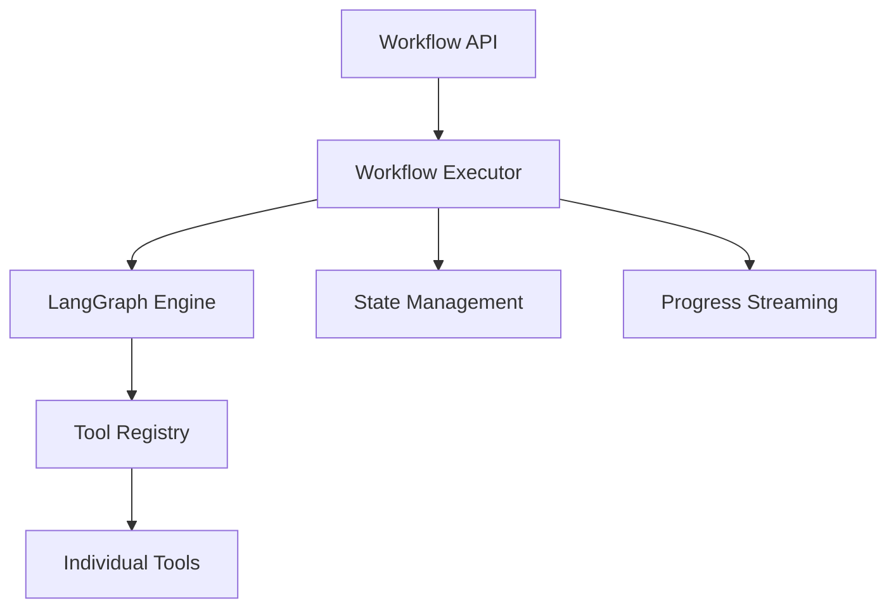
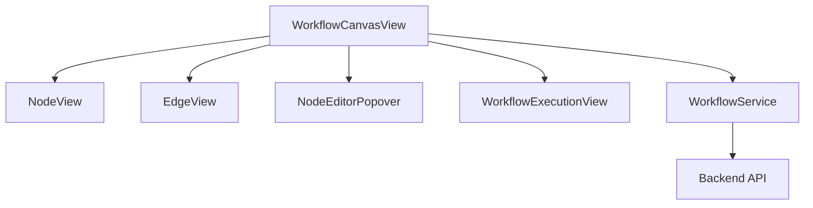
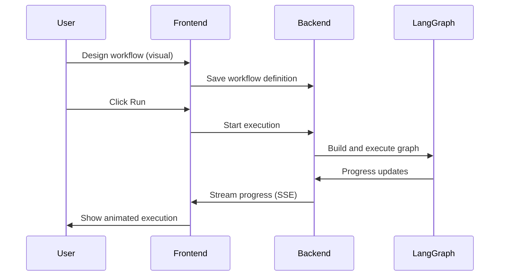

# Workflow Engine Development Plan

## Executive Summary

This plan outlines the comprehensive development of Fichero's workflow engine, integrating LangGraph backend with a SwiftUI node editor frontend. The workflow engine will enable users to visually design, execute, and monitor complex document processing pipelines.

### Key Objectives
- **Backend**: LangGraph integration for powerful workflow execution
- **Frontend**: Audio Hijack Pro-inspired node editor in SwiftUI
- **Integration**: Seamless connection between visual editor and execution engine
- **Performance**: Efficient concurrent execution utilizing multiple cores
- **User Experience**: Real-time animation and progress tracking

## Phase 1: Research and Architecture (Current Phase)

### Step 1: Review Current Codebase ✅
**Status**: Completed - Analyzed existing workflow-related code

**Findings**:
- Existing `Workflow.swift`, `WorkflowStore.swift`, `WorkflowTypes.swift` in Models
- Basic workflow execution framework in place
- Workflow.swift file already added to Xcode project
- No existing LangGraph integration
- Basic node editor concepts present but not implemented

### Step 2: LangGraph Capabilities Research ✅
**Status**: Completed - Reviewed LangGraph documentation and examples

**Key Capabilities**:
- StateGraph for workflow definition
- Async execution with state management
- Conditional routing and branching
- Parallel execution support
- Integration with LangChain tools

**Implementation Strategy**:
- Use `StateGraph` as core execution engine
- Map visual nodes directly to LangGraph nodes
- Implement custom state management for document tracking
- Leverage LangGraph's built-in concurrency features

### Step 3: Backend API Design ✅
**Status**: Completed - Designed comprehensive backend architecture

#### Core Components:

1. **Workflow Executor** (`src/fichero/workflows/executor.py`)
   - Builds LangGraph from workflow definition
   - Manages document state during execution
   - Handles progress events for UI updates

2. **Tool Registry** (`src/fichero/workflows/registry.py`)
   - Central registry of all workflow tools
   - Port definitions for input/output connections
   - Tool discovery API endpoint

3. **State Management**
   - Tracks document progress through workflow
   - Manages artifacts and intermediate results
   - Handles error states and retries

#### API Endpoints:

```python
# Workflow Management
POST /workflows              # Create/update workflow
GET /workflows/{id}          # Get workflow definition
GET /workflows              # List workflows

# Workflow Execution
POST /workflows/{id}/run     # Start execution
GET /workflows/{id}/stream   # SSE progress stream
POST /workflows/{id}/cancel  # Cancel execution

# Tool Discovery
GET /tools                  # List all tools with ports
GET /tools/{name}           # Get tool definition
```

### Step 4: Frontend Architecture Design ✅
**Status**: Completed - Designed SwiftUI node editor architecture

#### Core Components:

1. **Canvas System**
   - Infinite canvas with zoom/pan
   - Grid background with snapping
   - Node drag-and-drop placement

2. **Node System**
   - Visual nodes with input/output ports
   - Bezier curve connections
   - Node selection and editing

3. **Execution View**
   - Animated workflow execution
   - Real-time progress tracking
   - Status indicators and error handling

#### Key SwiftUI Views:
- `WorkflowCanvasView`: Main canvas with nodes and edges
- `NodeView`: Individual node with ports
- `EdgeView`: Bezier curve connections
- `WorkflowExecutionView`: Animated execution display

## Phase 2: Backend Implementation

### Step 5: Core Workflow Engine
**Priority**: P0 (Critical Path)
**Estimated Time**: 3-5 days

**Tasks**:
1. Implement `WorkflowExecutor` class with LangGraph integration
2. Create state management for document tracking
3. Implement progress event system for UI updates
4. Add error handling and retry logic
5. Implement concurrent execution with resource management

**Files to Create/Modify**:
- `src/fichero/workflows/executor.py` (new)
- `src/fichero/workflows/types.py` (modify)
- `src/fichero/workflows/state.py` (new)

### Step 6: Tool Registry System
**Priority**: P1 (High)
**Estimated Time**: 2-3 days

**Tasks**:
1. Implement tool registry with port definitions
2. Register existing tools with proper ports
3. Create tool discovery API endpoints
4. Implement tool validation and type checking

**Files to Create/Modify**:
- `src/fichero/workflows/registry.py` (new)
- `src/fichero/api/routes/workflows.py` (modify)
- Various tool files in `src/fichero/workflows/tools/`

### Step 7: Logic Nodes Implementation
**Priority**: P1 (High)
**Estimated Time**: 2-3 days

**Tasks**:
1. Implement IF node with condition evaluation
2. Implement Switch node for multi-way routing
3. Implement Loop node for iteration
4. Implement Filter and Merge nodes
5. Add conditional edge support

**Files to Create**:
- `src/fichero/workflows/tools/logic.py`
- `src/fichero/workflows/resolver.py` (for condition evaluation)

### Step 8: Source and Sink Nodes
**Priority**: P2 (Medium)
**Estimated Time**: 2 days

**Tasks**:
1. Implement Files source node (drag/drop)
2. Implement Collection source node
3. Implement Search source node
4. Implement Export sink node
5. Implement Webhook sink node

**Files to Create**:
- `src/fichero/workflows/tools/sources.py`
- `src/fichero/workflows/tools/sinks.py`

## Phase 3: Frontend Implementation

### Step 9: Canvas Foundation
**Priority**: P1 (High)
**Estimated Time**: 3-4 days

**Tasks**:
1. Implement infinite canvas with zoom/pan
2. Add grid background with snapping
3. Implement node drag-and-drop
4. Add node selection (single/multi)
5. Implement canvas state persistence

**Files to Create/Modify**:
- `Fichero/Fichero/Views/WorkflowCanvasView.swift`
- `Fichero/Fichero/Models/Workflow.swift` (extend)

### Step 10: Node and Edge System
**Priority**: P1 (High)
**Estimated Time**: 4-5 days

**Tasks**:
1. Implement NodeView with input/output ports
2. Create EdgeView with Bezier curves
3. Implement edge connection logic
4. Add edge validation and type checking
5. Implement node deletion and duplication

**Files to Create**:
- `Fichero/Fichero/Views/NodeView.swift`
- `Fichero/Fichero/Views/EdgeView.swift`
- `Fichero/Fichero/Views/PortView.swift`

### Step 11: Node Editor Popover
**Priority**: P2 (Medium)
**Estimated Time**: 2-3 days

**Tasks**:
1. Implement Audio Hijack style popover
2. Add provider/model selection
3. Create dynamic config forms from JSON schema
4. Add delete/duplicate actions
5. Implement node renaming

**Files to Create**:
- `Fichero/Fichero/Views/NodeEditorPopover.swift`
- `Fichero/Fichero/Views/ToolConfigForm.swift`

### Step 12: Execution Animation
**Priority**: P2 (Medium)
**Estimated Time**: 3 days

**Tasks**:
1. Implement animated workflow execution
2. Add real-time progress tracking
3. Create status indicators (pending, running, completed, failed)
4. Implement error handling UI
5. Add cancel/pause controls

**Files to Create**:
- `Fichero/Fichero/Views/WorkflowExecutionView.swift`
- `Fichero/Fichero/Views/ExecutionStatusView.swift`

## Phase 4: Integration

### Step 13: Backend-Frontend Integration
**Priority**: P0 (Critical Path)
**Estimated Time**: 3-4 days

**Tasks**:
1. Connect SwiftUI editor to backend API
2. Implement workflow serialization/deserialization
3. Add real-time progress streaming
4. Implement error handling and user feedback
5. Add performance monitoring

**Files to Modify**:
- `Fichero/Fichero/Services/WorkflowService.swift`
- `src/fichero/api/routes/workflows.py`

### Step 14: MCP Integration
**Priority**: P2 (Medium)
**Estimated Time**: 2 days

**Tasks**:
1. Implement MCP tool discovery
2. Create dynamic MCP node generation
3. Add MCP tool execution in workflows
4. Implement MCP error handling

**Files to Create/Modify**:
- `src/fichero/workflows/mcp_integration.py`
- `Fichero/Fichero/Services/MCPService.swift`

## Phase 5: Testing and Optimization

### Step 15: Unit Testing
**Priority**: P1 (High)
**Estimated Time**: 3 days

**Tasks**:
1. Test workflow execution engine
2. Test tool registry and validation
3. Test SwiftUI canvas interactions
4. Test edge cases and error conditions

**Files to Create**:
- `tests/unit/test_workflow_executor.py`
- `tests/unit/test_tool_registry.py`
- `Fichero/FicheroTests/WorkflowCanvasTests.swift`

### Step 16: Performance Optimization
**Priority**: P1 (High)
**Estimated Time**: 2-3 days

**Tasks**:
1. Optimize concurrent execution
2. Implement resource pooling
3. Add caching for tool results
4. Optimize SwiftUI rendering
5. Add performance monitoring

**Files to Modify**:
- `src/fichero/workflows/executor.py`
- `Fichero/Fichero/Views/WorkflowCanvasView.swift`

### Step 17: Stress Testing
**Priority**: P2 (Medium)
**Estimated Time**: 2 days

**Tasks**:
1. Test with 1000+ documents
2. Test complex branching workflows
3. Test memory usage and leaks
4. Test long-running workflows

**Files to Create**:
- `tests/stress/test_workflow_stress.py`
- `tests/stress/test_concurrent_execution.py`

## Phase 6: Polish and Documentation

### Step 18: User Experience Polish
**Priority**: P2 (Medium)
**Estimated Time**: 2 days

**Tasks**:
1. Add keyboard shortcuts
2. Implement copy/paste nodes
3. Create workflow templates
4. Add export/import functionality
5. Implement mini-map for large workflows

**Files to Modify**:
- Various SwiftUI views
- Add keyboard shortcut handlers

### Step 19: Comprehensive Documentation
**Priority**: P1 (High)
**Estimated Time**: 2 days

**Tasks**:
1. Write workflow engine documentation
2. Create API documentation
3. Write user guide for node editor
4. Add code comments and docstrings
5. Create architecture diagrams

**Files to Create**:
- `docs/workflow_engine.md`
- `docs/api/workflows.md`
- `docs/user_guide/node_editor.md`

### Step 20: Final Testing and QA
**Priority**: P0 (Critical Path)
**Estimated Time**: 2-3 days

**Tasks**:
1. End-to-end testing
2. User acceptance testing
3. Bug fixing
4. Performance tuning
5. Final code review

## Implementation Roadmap

### Week 1-2: Backend Foundation
- ✅ Research and planning (Current)
- Workflow executor implementation
- Tool registry system
- Basic workflow execution

### Week 3-4: Frontend Foundation
- SwiftUI canvas implementation
- Node and edge system
- Basic node editor

### Week 5-6: Integration and Logic
- Backend-frontend integration
- Logic nodes (IF, Switch, Loop)
- Source/sink nodes
- Real-time progress streaming

### Week 7-8: Testing and Optimization
- Unit testing
- Performance optimization
- Stress testing
- Bug fixing

### Week 9: Polish and Documentation
- User experience improvements
- Comprehensive documentation
- Final testing and QA

## Technical Architecture

### Backend Architecture



### Frontend Architecture



### Data Flow



## Performance Considerations

### Concurrent Execution Strategy
- **Resource Pooling**: Limit concurrent API calls based on provider rate limits
- **Batch Processing**: Process documents in batches for efficiency
- **Parallel Nodes**: Execute independent branches in parallel
- **Core Utilization**: Distribute work across available CPU cores
- **Memory Management**: Stream large documents to avoid memory overload

### SwiftUI Optimization
- **View Recycling**: Reuse node views when possible
- **Lazy Rendering**: Only render visible portion of canvas
- **Animation Optimization**: Use efficient animation techniques
- **State Management**: Minimize unnecessary view updates
- **Memory Management**: Clean up unused resources

## Error Handling Strategy

### Backend Error Handling
- **Retry Logic**: Automatic retry for transient failures
- **Error Classification**: Distinguish between recoverable and fatal errors
- **Graceful Degradation**: Continue with partial results when possible
- **Detailed Logging**: Comprehensive error logging for debugging

### Frontend Error Handling
- **User-Friendly Messages**: Clear, actionable error messages
- **Visual Indicators**: Red nodes/edges for failed components
- **Recovery Options**: Retry buttons and alternative paths
- **Error Reporting**: Easy way for users to report issues

## Monitoring and Analytics

### Key Metrics to Track
- **Execution Time**: Total workflow duration
- **Document Throughput**: Documents processed per minute
- **Success Rate**: Percentage of successful executions
- **Error Rates**: Frequency and types of errors
- **Resource Utilization**: CPU, memory, network usage

### Implementation Plan
- Add instrumentation to workflow executor
- Implement logging for key events
- Create dashboard for monitoring
- Add alerting for critical failures

## Risk Assessment and Mitigation

### High Risks
1. **LangGraph Integration Complexity**
   - Mitigation: Start with simple workflows, gradually add complexity
   - Strategy: Comprehensive unit testing of core components

2. **Performance with Large Document Sets**
   - Mitigation: Implement batching and resource pooling early
   - Strategy: Stress testing with realistic document loads

3. **SwiftUI Canvas Performance**
   - Mitigation: Use proven patterns from Audio Hijack Pro
   - Strategy: Profile and optimize rendering early

### Medium Risks
1. **Complex Workflow Debugging**
   - Mitigation: Implement detailed logging and visualization
   - Strategy: Build debugging tools alongside core features

2. **Cross-Platform Compatibility**
   - Mitigation: Test on multiple macOS versions early
   - Strategy: Use standard SwiftUI patterns

3. **API Key Management**
   - Mitigation: Leverage existing keychain integration
   - Strategy: Test with various provider configurations

## Success Criteria

### Minimum Viable Product (MVP)
- ✅ Basic workflow execution with LangGraph
- ✅ Simple node editor with drag-and-drop
- ✅ Tool registry with core tools
- ✅ Real-time progress streaming
- ✅ Error handling and recovery

### Full Feature Set
- Complex branching and conditional workflows
- Concurrent execution with resource management
- Comprehensive tool library
- Advanced SwiftUI editor features
- Full MCP integration
- Performance optimization

### Stretch Goals
- Workflow templates and sharing
- Collaborative editing
- Cloud execution options
- Advanced analytics and reporting

## Next Steps

1. **Immediate**: Begin backend workflow executor implementation
2. **Parallel**: Start SwiftUI canvas foundation
3. **Weekly**: Progress reviews and adjustments
4. **Continuous**: Testing and optimization

## Resources Required

### Development Resources
- 1-2 backend developers (Python/LangGraph)
- 1-2 frontend developers (SwiftUI)
- 1 QA engineer
- 1 technical writer

### Infrastructure Resources
- Test environment with various macOS versions
- Performance testing infrastructure
- CI/CD pipeline for automated testing

### Timeline
- **Total Estimated Time**: 8-10 weeks
- **MVP Target**: 4-6 weeks
- **Full Feature Target**: 8 weeks
- **Stretch Goals**: 10+ weeks

## Conclusion

This comprehensive plan provides a clear roadmap for developing Fichero's workflow engine. By following this structured approach, we can deliver a powerful, user-friendly workflow system that leverages LangGraph's capabilities while providing an intuitive visual interface. The phased implementation allows for early testing and validation, ensuring a robust final product.
