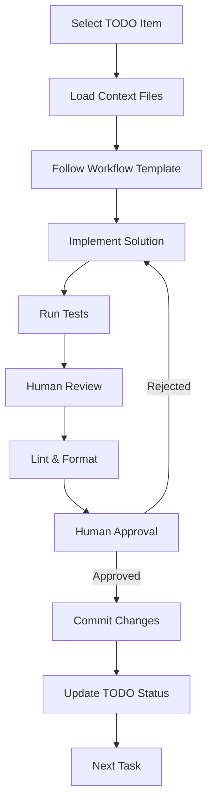

# Context Management System

## Overview

The Fichero context management system provides a structured approach to organize development information and guide AI-assisted development. This system enables focused development by providing context-specific information to AI while maintaining a systematic development workflow.

## System Components

### 1. AI Context Files

Located in `.ai_contexts/`, these files provide focused information for different development areas:

- **`backend_context.md`**: Python/FastAPI development patterns, API design, testing strategies
- **`frontend_context.md`**: SwiftUI development patterns, state management, API integration
- **`testing_context.md`**: Testing frameworks, strategies, and best practices
- **`workflow_context.md`**: Development lifecycle, task management, quality gates

### 2. Development Workflow Files

Located in `.development/`, these files define the systematic development process:

- **Workflow Templates**: Standardized templates for different task types
  - `backend_task.md`: Backend development workflow
  - `frontend_task.md`: Frontend development workflow  
  - `full_stack_task.md`: Full stack feature development
  - `testing_task.md`: Testing-focused tasks

- **Git Workflow**: Branch naming, commit messages, pre-commit hooks
- **Task Tracking**: Active task management and status tracking

### 3. TODO System Integration

Located in `.todo_system/`, this integrates the context management with the existing TODO system:

- **TODO Patterns**: Standardized formats for different feature areas
  - `backend_pattern.md`: Backend task structure
  - `frontend_pattern.md`: Frontend task structure
  - `ai_pattern.md`: AI feature development
  - `infrastructure_pattern.md`: Infrastructure tasks

- **Context Mappings**: Files that map contexts to specific development areas
- **Workflow Integration**: Task lifecycle definitions and human review points

## Development Workflow

### Task Lifecycle

### Using the System

#### 1. Starting a New Task

1. **Select TODO Item**: Choose the highest priority pending task from TODO.md
2. **Load Context**: Use the appropriate context file for the task type
3. **Follow Pattern**: Use the standardized TODO pattern for the feature area
4. **Update Status**: Change TODO status to "in-progress"

#### 2. Implementation

1. **Use Context Files**: Reference the appropriate `.ai_contexts/` file
2. **Follow Workflow**: Use the workflow template for systematic development
3. **Implement Features**: Follow the patterns and best practices
4. **Write Tests**: Ensure comprehensive test coverage

#### 3. Quality Assurance

1. **Code Review**: Use the checklists in context files
2. **Human Review**: Critical review points before commit
3. **Linting**: Run appropriate linters for the language
4. **Testing**: Verify all tests pass

#### 4. Completion

1. **Commit Changes**: Use standardized commit message format
2. **Update TODO**: Mark task as completed
3. **Clean Up**: Remove temporary files, update documentation
4. **Next Task**: Select next highest priority item

## Context Management Best Practices

### For AI Assistance

1. **Provide Focused Context**: Use the appropriate context file for the task
2. **Reference Patterns**: Follow the standardized TODO patterns
3. **Use Workflow Templates**: Follow the systematic development process
4. **Ask for Clarification**: When context is insufficient, request specific information

### For Human Developers

1. **Maintain Context Files**: Keep context files updated with current practices
2. **Follow Workflow**: Use the templates for consistent development
3. **Review at Checkpoints**: Provide oversight at critical points
4. **Update Patterns**: Improve patterns based on real-world usage

## Integration with Existing Systems

### TODO.md Integration

The context management system integrates with the existing TODO.md:

- TODO items reference context files and patterns
- Status updates are reflected in both systems
- Patterns ensure consistent task structure

### Git Integration

The system includes git workflow integration:

- Standardized branch naming based on TODO IDs
- Commit message templates that reference TODO items
- Pre-commit hooks for quality assurance

## Benefits

1. **Focused Development**: AI gets relevant context for each task type
2. **Consistent Quality**: Standardized patterns ensure uniform code quality
3. **Systematic Workflow**: Clear development process reduces errors
4. **Human Oversight**: Critical review points maintain quality
5. **Traceability**: Git history links to specific TODO items
6. **Maintainability**: Context files document development practices

## Future Enhancements

1. **Automated Context Switching**: AI automatically loads appropriate context
2. **Task Progress Tracking**: Automated status updates
3. **Quality Metrics**: Automated code quality measurement
4. **Context Versioning**: Track changes to context files
5. **AI Training**: Use context files to train AI on project-specific patterns